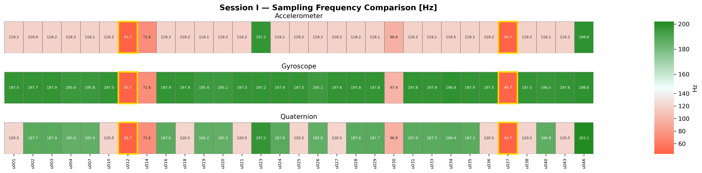
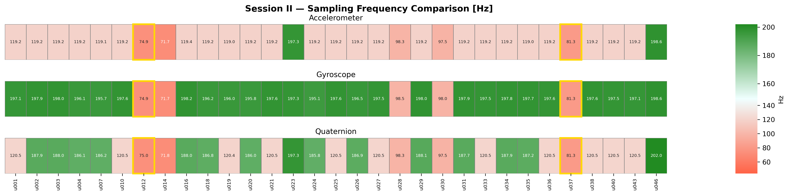

# SIGNET Dataset — Sampling Frequency Analysis

This repository provides a comparative analysis of raw IMU sensor data from the **SIGNET database**, publicly available at:
[https://signet.dei.unipd.it/research/human-sensing/](https://signet.dei.unipd.it/research/human-sensing/)

The analysis focuses on the **sampling frequency** of three sensor modalities: accelerometer, gyroscope, and rotation vector (quaternion), across two acquisition sessions and 31 participants.

---

## Why Sampling Frequency Matters in Biometric Experiments

Sampling frequency is a frequently overlooked source of **data leakage** in biometric experiments. When sensor sampling rates differ systematically between participants or sessions, a classifier may learn to distinguish individuals based on acquisition artifacts rather than genuine biometric traits. This introduces an unintended **bias** that inflates identification performance and reduces generalizability.

For a broader discussion of leakage and bias in biometric machine learning pipelines, see the Kaggle Accelerometer Biometric Competition:

- 🏆 [Accelerometer Biometric Competition](https://www.kaggle.com/competitions/accelerometer-biometric-competition) — Kaggle competition on IMU-based person identification
- 📄 [Competition description (PDF)](https://storage.googleapis.com/kaggle-forum-message-attachments/9976/gaddawin-description.pdf) — detailed problem statement and dataset description

---

## Dataset Overview

The SIGNET dataset was used with a subset of **31 participants** for whom recordings from both **Session I** (Day 1) and **Session II** (Day 2) were available. The three sensor modalities analyzed are:

- `accelerometer` — linear acceleration (x, y, z)
- `gyroscope` — angular velocity (x, y, z)
- `rotvec` — orientation quaternion (w, x, y, z)

---

## Session I — Sampling Frequency Comparison

In Session I, participants **u012** and **u037** exhibited a constant sampling frequency of approximately **40 Hz across all three modalities**. Compared to the rest of the cohort, this represents a boundary case: for the gyroscope, the median sampling frequency across other participants was approximately **200 Hz** — five times higher.

At 40 Hz, neither interpolation nor resampling provides a satisfactory remedy:

- **Interpolation** does not recover information that was never captured.
- **Decimation** of other participants' signals to 40 Hz leads to significant loss of biometric features, particularly gait-related high-frequency components.

Based on this analysis, a threshold of **fs < 50 Hz** was adopted as the exclusion criterion for participant data quality.

---

## Session II — Sampling Frequency Comparison

In Session II, u012 and u037 also showed elevated but still low sampling frequencies — **70 Hz and 80 Hz** respectively — placing them in the **lower percentiles** of the distribution across the cohort. While slightly improved compared to Session I, these values remain substantially below the typical range and are consistent with a systematic acquisition issue for these two participants.

---

## Repository Contents

| File | Description |
|------|-------------|
| `freq_analysis.py` | Loads raw `.log` files for all 31 participants and both sessions, computes mean sampling frequency per modality (accelerometer, gyroscope, quaternion), and saves results to `fs_analysis.csv` |
| `freq_plots.py` | Reads `fs_analysis.csv` and produces heatmap visualizations (one figure per session, three panels per modality) and a boxplot comparison across modalities and sessions; participants u012 and u037 are highlighted |
| `fs_analysis.csv` | Output CSV — 31 participants × 2 sessions × 3 modalities, columns: `user`, `session`, `fs_accel`, `fs_gyro`, `fs_quat` |
| `fs_heatmap_session1.png` | Heatmap of sampling frequencies — Session I |
| `fs_heatmap_session2.png` | Heatmap of sampling frequencies — Session II |
| `fs_boxplot.png` | Boxplot comparison of fs across modalities and sessions |

---

## Excluded Participants

| Participant | Reason |
|-------------|--------|
| u012 | fs ≈ 40 Hz (Session I), fs ≈ 70 Hz (Session II) — below 50 Hz threshold |
| u037 | fs ≈ 40 Hz (Session I), fs ≈ 80 Hz (Session II) — below 50 Hz threshold |

The remaining **29 participants** form the final analysis cohort.
